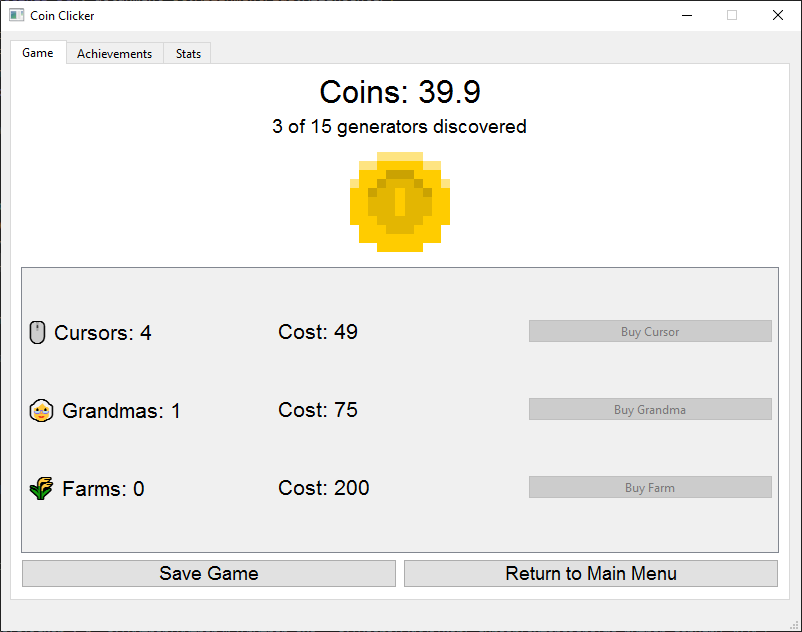

# Clicker Game

A simple clicker game built with PyQt6 where you click to earn coins, buy upgrades and increase your earnings per second.



## Features

- Simple coin clicking mechanics
- Various upgrades to purchase
- Automatic coin generation from upgrades
- Achievement system
- Statistics tracking
- Auto-save functionality

## How to Play

1. Click the coin to earn coins manually
2. Use earned coins to purchase upgrades
3. Upgrades will automatically generate coins over time
4. Unlock achievements by reaching specific milestones
5. Check your stats to see how you're progressing

## Requirements

- Python 3.6+
- PyQt6
- Windows (for sound support)

## Installation

1. Clone this repository
2. Install the required dependencies:
   ```
   pip install PyQt6
   ```
3. Run the game:
   ```
   python clicker_game.py
   ```

## Controls

- Left-click on the coin to earn coins
- Click on upgrade buttons to purchase upgrades
- Navigate through tabs to view achievements, statistics, and more

## Game Mechanics

- Each upgrade increases your coins per second (CPS)
- Upgrades become more expensive as you buy more of the same type
- Higher tier upgrades provide better CPS but require more initial investment
- Your game auto-saves periodically

## Image Assets
The coin image is from https://mozdevs.github.io/html5-games-workshop/assets/platformer/coin_spritesheet.png

## Contributing

Feel free to fork this project and submit pull requests with your enhancements or fixes. 