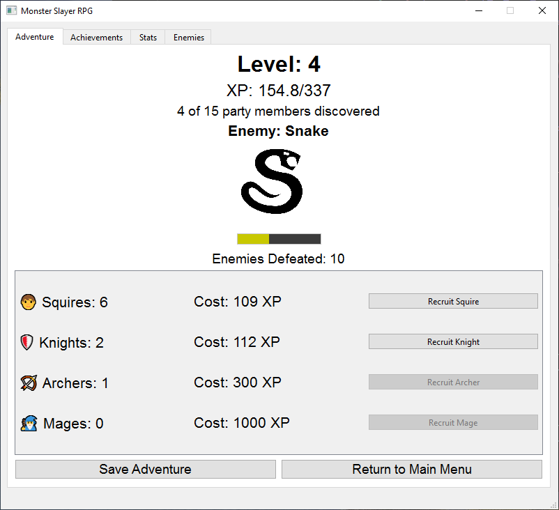

# Monster Slayer RPG

A fantasy RPG-themed clicker game built with PyQt6 where you defeat monsters, recruit party members, and earn XP to level up.



## Features

- Monster slaying gameplay mechanics
- RPG-style leveling system
- 15 different party members to recruit, each with unique abilities
- Achievement system for various milestones
- Detailed statistics tracking
- Enemy database with defeat counts
- Auto-save functionality

## How to Play

1. Click on monsters to deal damage and defeat them
2. Earn XP from defeating monsters
3. Use XP to recruit party members who deal automatic damage
4. Level up by earning sufficient XP
5. Unlock achievements through your heroic deeds
6. Build a powerful adventuring party to defeat more monsters

## Requirements

- Python 3.6+
- PyQt6
- Windows (for sound support)

## Installation

1. Clone this repository
2. Install the required dependencies:
   ```
   pip install PyQt6
   ```
3. Run the game:
   ```
   python rpg_game.py
   ```

## Party Members

Recruit various party members to assist you in your adventure:
- Squire: A novice fighter who helps you attack monsters
- Knight: A trained warrior with better fighting skills
- Archer: Attacks monsters from a distance
- Mage: Uses magic to damage multiple monsters at once
- Healer: Keeps your party healthy for longer fights
- And many more powerful allies...

## Game Mechanics

- Click to deal damage to monsters manually
- Each party member provides automatic damage over time
- Monsters get tougher as you progress
- XP required for leveling up increases with each level
- Party members become more expensive as you recruit more
- Your adventure auto-saves periodically

## Achievement System

Unlock various achievements by:
- Defeating your first monster
- Reaching certain level milestones
- Recruiting specific party members
- And many more challenges...

## Image Assets
The images are from https://game-icons.net/

## Contributing

Feel free to fork this project and submit pull requests with your enhancements or fixes. 