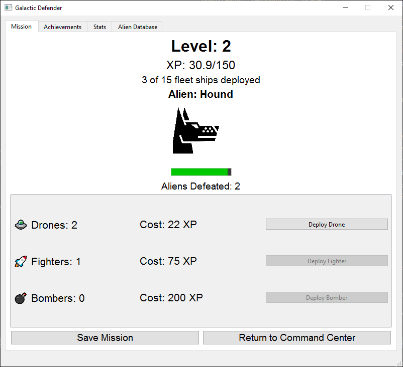

# Galactic Defender

A space-themed clicker game built with PyQt6 where you defend the galaxy from alien invaders by deploying various spacecraft.



## Features

- Space combat gameplay mechanics
- Fleet building and management
- 15 different spacecraft to deploy, from basic drones to powerful universe guardians
- Achievement system for various milestones
- Detailed statistics tracking
- Alien database with defeat records
- Auto-save functionality

## How to Play

1. Click on alien ships to damage and defeat them
2. Earn XP from defeating aliens
3. Use XP to deploy spacecraft that deal automatic damage
4. Level up by earning sufficient XP
5. Unlock achievements through your space missions
6. Build a powerful galactic fleet to defend against the alien invasion

## Requirements

- Python 3.6+
- PyQt6
- Windows (for sound support)

## Installation

1. Clone this repository
2. Install the required dependencies:
   ```
   pip install PyQt6
   ```
3. Run the game:
   ```
   python space_game.py
   ```

## Fleet Ships

Deploy various spacecraft to assist in your mission:
- Drone: A basic drone that attacks alien ships
- Fighter: A small fighter ship with laser weapons
- Bomber: Attacks alien fleets with explosive payloads
- Cruiser: Medium-sized ship with advanced weapons systems
- Repair Ship: Keeps your fleet operational during battle
- And many more powerful vessels...

## Game Mechanics

- Click to damage alien ships manually
- Each spacecraft provides automatic damage over time
- Aliens become more challenging as you progress
- XP required for leveling up increases with each level
- Spacecraft become more expensive as you deploy more units
- Your mission auto-saves periodically

## Achievement System

Unlock various achievements by:
- Defeating your first alien ship
- Reaching certain level milestones
- Deploying specific spacecraft
- And many more galactic challenges...

## Image Assets
The images are from https://game-icons.net/

## Contributing

Feel free to fork this project and submit pull requests with your enhancements or fixes. 